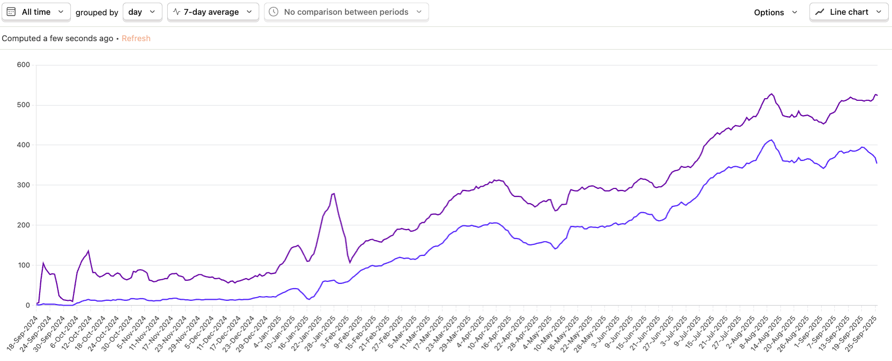
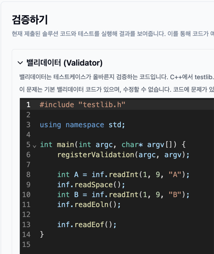
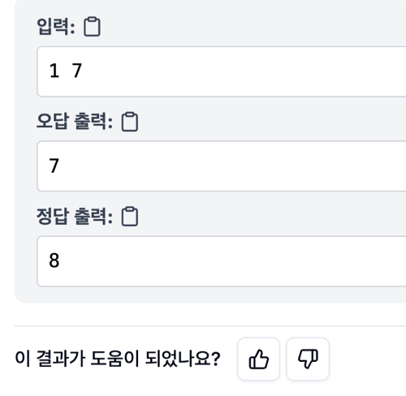

(This is automatically translated via Codex from Korean version)

Hello, I am Jaechan Lee, the developer of [testcase.ac](http://testcase.ac). On Baekjoon, I use the handle `dlwocks31`.

I started developing testcase.ac in August 2024, and the service properly launched together with the Baekjoon board post [Introducing testcase.ac, a project that finds counterexamples for my code!](https://www.acmicpc.net/board/view/150756) on October 5, 2024. It now gets around 500 visitors per day on average, with about 2,000 submissions every day. That is a meaningful amount of usage.



_Purple is the number of visitors, and blue is the number of users who found counterexamples. I use PostHog to track the data._

Going forward, I plan to use [help.testcase.ac](https://help.testcase.ac/) to write in more detail about how to use the site and what updates have been made.

## Launching the service

The core feature of testcase.ac is simple. Contributors upload generator code and accepted solution code for a Baekjoon problem, and when a user submits their incorrect code, testcase.ac keeps running the generator until it finds a counterexample. The service started with only this minimum functionality.

At first, contributors could only add generators that produced multiple random test cases. Later, support was added for single test cases, code that generates one large custom test case, and checker code for special judge problems.

The biggest problem I ran into after launch was that although users could contribute generators directly, those generators sometimes produced test cases in the wrong format. For example, a generator might output numbers separated by spaces when they should be separated by newlines.

```
// Correct:
1
2
3
4
5

// Wrong:
1 2 3 4 5
```

I made those kinds of mistakes myself when contributing, so this was not an issue limited to specific contributors. These errors are critical because they can make a correct solution produce a wrong output, but there was no reliable way to catch them except for someone reporting the problem manually. That made it clear that I needed a systematic way to validate generators.

## Validators

To solve this problem, I added validators for every problem and made testcase.ac check whether generated results pass validator checks whenever a generator or test case is registered.

_(A validator is a program that takes a test case as input and checks whether that test case is valid. Validators can be written with [testlib.h](https://github.com/MikeMirzayanov/testlib), the standard library used for competitive programming problem preparation.)_

You can see the validator attached to a problem at the bottom of that problem's Contribute tab. Below is an example validator for problem 1000.



At first, I created and added these validators manually for each problem. Later, I started having LLMs, meaning AI models such as GPT-5, generate validators automatically. Fortunately, [OpenAI provides free credits](https://help.openai.com/en/articles/10306912-sharing-feedback-evaluation-and-fine-tuning-data-and-api-inputs-and-outputs-with-openai#h_f2f71332e6), so there has not been much cost pressure yet.

Automatically generated validators are currently accepted and attached to a problem only if they correctly judge the official Baekjoon samples as valid test cases. Of course, these generated validators can still be wrong sometimes, so I still manually review reports whenever someone points out an issue. Even so, the frequency of malformed generators or bad test cases being added has dropped significantly compared with before.

## Generators

Generator code is the core of testcase.ac. It took a great deal of effort to build in the beginning. Accepted solution code was comparatively easy, since it could usually be taken from code that had already received an accepted verdict on Baekjoon. Generators were harder because each problem needed a new one.

When I first tried using LLMs to create generators, I learned that if you simply prompt an LLM with something like "make a generator," it can produce incorrect code in many different ways. Cases where the code does not run at all or falls into an infinite loop are relatively manageable because you can discover those just by executing it. The most difficult cases are errors that are not obvious at a glance, such as violating the problem constraints or producing the wrong format.

Once I started generating validators first and then only using generators that produce test cases accepted by those validators, I was able to build a process that verifies LLM output. After that, generators created by LLMs became trustworthy enough to use in practice.

Now there is an LLM-based automatic generator creation button in the Contribute tab so that anyone can easily add a generator for a problem that does not already have one.


## Collecting feedback

Because automatically generated generators and validators still rely heavily on LLMs, there are unavoidable weak points. Sometimes testcase.ac finds fake counterexamples because of incorrect test case formatting, and sometimes it fails to find a counterexample even though the code is wrong because the generated test cases are not strong enough.

To address that, I started collecting feedback after submissions with the question "Was this result helpful?" My goal is to read and respond to as much of that feedback as possible.



## Going forward

I still feel that the testcase.ac platform has many shortcomings. I am thinking through several ideas to make it more practically useful for solving problems.

- Generate adaptive counterexamples for a given wrong solution using LLMs

By giving the wrong code and the problem to an LLM, it is possible to generate an explanation of why the code is wrong and exactly which counterexamples break it. This could help testcase.ac find counterexamples even in cases where the existing generators fail.

This feature is currently being tested internally on code from users who left negative feedback in response to the question "Was this result helpful?" I hope to share more broadly about it soon.

- Show the reason for runtime errors in C and C++

Tools such as `valgrind` and `gdb` can provide much more precise information about where and why runtime errors happen, even without an IDE. Right now, if a runtime error occurs in C or C++, there is no detailed explanation of where it happened, so users still need to rerun the code locally. My goal is to use tools like these to explain runtime errors much more clearly inside testcase.ac.

- Allow generators to run more than 100 times

Right now, the counterexample search feature runs a generator at most 100 times. That limit is sufficient in most cases, but it is not enough for code that fails only with low probability.

Simply increasing the number of runs would make results slower even when a failing test case is found quickly, and it would also increase server costs. I am still thinking about how to balance that well, for example through real-time judging progress, infrastructure optimizations, or covering costs with ads.

## Back to the beginning

The original motivation for building testcase.ac came from seeing people ask for counterexamples on the Baekjoon question board. It reminded me of how frustrated I used to feel when I could not understand why my answer was wrong, and I could not just ignore that. I felt there should be a better way than depending on individual people to leave helpful replies out of goodwill, and that is what led me to build testcase.ac. In a sense, this was exactly the service my past self needed, and wanting to build something my past self would have wanted is still what drives me to keep developing it.

I also have a separate main job, so I cannot spend all my time on this. Even so, I plan to keep working on it steadily.

If you have any feedback you would like to share about the site, please feel free to leave a comment on this post, a comment on the Baekjoon board post, or send me an email. Thank you.
