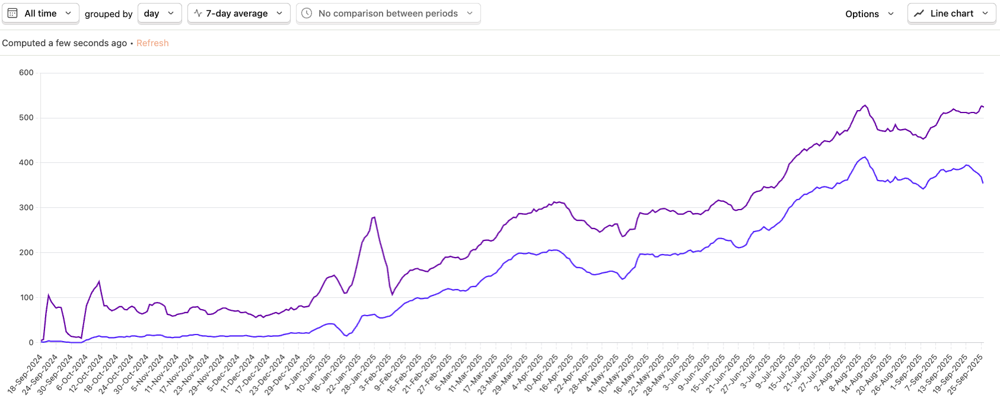

안녕하세요, [testcase.ac](http://testcase.ac)의 개발자 이재찬입니다. 백준에서는 dlwocks31이라는 핸들을 쓰고 있습니다.

testcase.ac는 2024년 8월에 개발을 시작하여, 2024년 10월 5일 백준 게시판에 업로드된 [내 코드의 반례를 찾아주는 testcase.ac 프로젝트를 소개합니다!](https://www.acmicpc.net/board/view/150756) 글과 함께 서비스를 본격적으로 시작했습니다. 지금은 하루 평균 약 500명의 사용자가 방문하고, 매일 약 2,000건의 제출이 이뤄지고 있습니다. 나름 많은 분들이 찾아주고 있다고 할 수 있겠습니다.



_보라색은 방문자 수, 파란색은 반례를 찾은 사용자 수입니다. PostHog를 이용해 데이터를 확인하고 있습니다._

앞으로 [help.testcase.ac](https://help.testcase.ac/)를 통해 사이트 사용법과 업데이트 내역에 대해 조금 더 자세히 적어 보려고 합니다.

## 서비스 시작

testcase.ac의 핵심 기능은 기여자가 백준 문제에 대해 제너레이터와 정답 코드를 올려두면, 사용자가 자신의 오답 코드를 제출했을 때 반례가 나올 때까지 제너레이터를 계속 실행해 반례를 찾아주는 것입니다. testcase.ac는 이 최소한의 기능만 제공하며 시작했습니다.

처음에는 여러 테스트케이스를 랜덤으로 만드는 제너레이터만 추가할 수 있었지만, 이후에는 단일 테스트케이스 추가, 큰 테스트케이스를 코드로 추가하는 기능도 지원하기 시작했습니다. 또한, 체커를 사용해야 하는 스페셜 저지 문제도 이후에 추가되었습니다.

서비스를 시작한 후 본격적으로 맞닥트린 가장 큰 문제는, 사용자가 제너레이터를 직접 기여할 수 있지만 이렇게 기여된 제너레이터가 만드는 테스트케이스의 형식이 올바르지 않은 경우가 종종 있었다는 점입니다. 예를 들어 숫자를 줄바꿈으로 구분해야 하는데 공백으로 구분하는 테스트케이스를 출력하는 제너레이터가 올라오는 경우가 있습니다.

```
// Correct:
1
2
3
4
5

// Wrong:
1 2 3 4 5
```

제가 기여할 때도 이런 실수가 종종 있었기 때문에 특정 기여자의 문제만은 아니었습니다. 이러한 오류는 올바른 코드가 틀린 출력을 하도록 하기 때문에 치명적인 문제이지만, 누군가가 이러한 오류를 수동으로 제보하는 것 외에는 문제를 잡아낼 방법이 마땅치 않았습니다. 이에 제너레이터를 체계적으로 검증할 수단이 필요해졌습니다.

## 밸리데이터

이 문제를 해결하기 위해 모든 문제에 밸리데이터를 추가하고, 제너레이터와 테스트케이스를 등록할 때 생성된 결과가 밸리데이터 검사를 통과하는지 확인하도록 했습니다.

_(밸리데이터(validator)는 테스트케이스를 입력으로 받아 해당 테스트케이스가 올바른지 알려주는 프로그램입니다. 경쟁 프로그래밍 문제 출제에 사용되는 표준 라이브러리인 [testlib.h](https://github.com/MikeMirzayanov/testlib)로 밸리데이터를 작성할 수 있습니다.)_

각 문제의 '기여하기' 탭 맨 아래에서 그 문제에 추가되어 있는 밸리데이터를 확인할 수 있습니다. 아래는 1000번 문제에 추가되어 있는 밸리데이터 예시입니다.


처음에는 이 밸리데이터를 각 문제마다 수동으로 만들어 추가했지만, 그 후로는 LLM(GPT-5와 같은 AI 모델)이 자동으로 밸리데이터를 만들게 하고 있습니다. 다행히 [OpenAI에서 제공하는 무료 크레딧](https://help.openai.com/en/articles/10306912-sharing-feedback-evaluation-and-fine-tuning-data-and-api-inputs-and-outputs-with-openai#h_f2f71332e6)이 있어서 아직 비용 부담은 없습니다.

자동으로 생성된 밸리데이터는 단순히 "백준 예제를 올바른 테스트케이스로 판정하는지" 여부로 올바른지 판정해 문제에 추가하고 있습니다. 물론 이렇게 자동으로 생성된 밸리데이터가 틀릴 때도 있어, 여전히 수동으로 누군가의 제보가 들어올 때마다 확인하고 있습니다. 그래도 형식이 틀린 제너레이터나 테스트케이스가 추가되는 문제가 발생하는 빈도는 기존보다 훨씬 줄었습니다.

## 제너레이터

제너레이터 코드는 testcase.ac 서비스의 핵심입니다. 그만큼 처음에는 만드는 데 많은 노력이 들어갔습니다. 정답 코드는 백준에서 그동안 정답을 받은 코드를 옮겨오면 되기 때문에 들이는 노력이 상대적으로 적었지만, 제너레이터는 문제마다 새롭게 만들어야 하기 때문에 더 어려웠습니다.

LLM을 이용해 제너레이터를 만드는 것을 처음에 시도했을 때, LLM에게 단순히 "제너레이터 만들어 줘"라고 프롬프트를 주면 LLM이 정말 다양한 방식으로 틀린 코드를 내놓는다는 것을 알 수 있었습니다. 아예 실행되지 않는 경우나 무한 루프를 도는 경우는 사실 실행해 보면 알 수 있으니 그나마 나았습니다. 문제의 조건을 지키지 않거나 형식이 맞지 않는 등 한눈에 알아보기 쉽지 않은 오류를 포함할 때가 가장 난감했습니다.

하지만 밸리데이터를 먼저 만들고, 그 밸리데이터를 통과하는 테스트케이스만 생성하는 제너레이터를 사용하도록 하는 식으로, LLM의 출력을 검증할 수 있는 프로세스를 만들고 나니, LLM이 만든 제너레이터도 어느 정도 신뢰할 수 있었습니다.

지금은 누구나 제너레이터가 없는 문제에 대해 쉽게 제너레이터를 추가할 수 있도록 기여하기 탭에 LLM을 이용한 제너레이터 자동 생성 버튼을 추가해 두었습니다.


## 피드백 받기

자동 생성한 제너레이터와 밸리데이터도 LLM에 대부분 의존하다 보니 부족한 점이 있을 수밖에 없습니다. 테스트케이스 형식이 맞지 않아 정답 코드에서도 가짜 반례를 찾아내는 일도 있고, 만들어낸 테스트케이스가 충분히 강하지 않아 틀린 코드임에도 불구하고 반례를 찾지 못하는 경우도 있습니다.

이를 보완하기 위해 제출 후 화면에서 "이 결과가 도움이 되었나요?"라는 질문으로 피드백을 받기 시작했습니다. 보내주신 피드백은 최대한 모두 읽고 대응하는 것이 목표입니다.


## 앞으로

testcase.ac 플랫폼은 아직 부족한 점이 많다고 느끼고 있습니다. 문제 풀이에 실질적으로 도움이 되기 위해 여러 가지 아이디어를 고민하고 있습니다.

- **LLM을 이용해 주어진 틀린 코드에 대해 적응형으로 반례를 생성하기**

LLM을 사용해 틀린 코드와 문제를 입력했을 때, 그 코드가 왜 틀렸는지, 그리고 정확히 어떤 반례에서 틀리는지를 생성해 볼 수 있습니다. 이를 이용해 기존 제너레이터가 반례를 찾지 못하는 경우에도 반례를 찾을 수 있도록 시도해 볼 수 있습니다.

이 기능은 "이 결과가 도움이 되었나요?"라는 질문에서 부정 피드백을 남겨 주신 코드에 대해 내부적으로 테스트해 보고 있는 단계입니다. 조만간 더 널리 공유할 수 있으면 좋겠습니다.

- **C/C++ 코드에 대해 런타임 에러의 이유를 보여 주기**

valgrind와 gdb 같은 툴을 이용하면 IDE 없이도 런타임 에러가 발생하는 위치와 이유를 보다 정확히 알 수 있습니다. 현재는 C와 C++에서 런타임 에러가 발생해도 구체적으로 어디서 에러가 발생했는지 알 수 없어 로컬에서 직접 다시 돌려봐야 하지만, 이런 툴을 활용해 testcase.ac 내에서 런타임 에러의 원인을 더 자세히 알려주는 것을 목표로 하고 있습니다.

- **제너레이터 100번 이상 실행할 수 있도록 하기**

현재 반례 찾기 기능은 제너레이터를 최대 100번까지만 실행하고 있습니다. 이 100번이라는 제한은 대부분의 경우 충분하지만, 낮은 확률로 틀리는 코드들에 대해서는 부족합니다.

무작정 실행 횟수를 늘리면 빠르게 테스트케이스를 찾은 경우에도 결과를 늦게 보여 주게 되고, 서버 비용도 조금 더 부담이 됩니다. 이에 균형을 맞출 수 있는 방법을 고민하고 있습니다. (실시간 채점 상태 보여 주기 / 서버 인프라 최적화 / 광고로 비용 충당 등)

## 다시 처음으로

testcase.ac를 처음 만들게 된 계기는 백준 질문 게시판에서 반례를 찾는 게시글들이 보여서였습니다. 제가 한창 백준에서 알고리즘 문제 풀이를 할 때 "맞왜틀"에 답답했던 모습이 생각나서 그냥 지나칠 수는 없었습니다. 선의로 답변을 달아주는 사람들 한 명 한 명에게 의존하는 것보다는 조금 더 나은 방법이 있을 거라 생각했고, 그 결과로 testcase.ac 서비스를 만들게 되었습니다. 어떻게 보면 과거의 저에게 너무나 필요한 서비스였고, 과거의 저에게 필요한 서비스를 만들고 싶다는 마음이 개발을 이어가는 원동력이 되고 있습니다.

본업이 따로 있는지라 여기에 많은 시간을 쏟지는 못하고 있습니다. 그래도 앞으로 천천히라도 계속 개발을 이어가 보겠습니다.

혹시 사이트에 주고 싶은 피드백이 있다면 언제나 이 글의 댓글 / 백준 게시판의 댓글 / 이메일로 남겨 주세요. 감사합니다.
